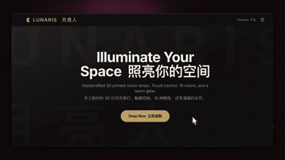

# LUNARIS — 3D 打印月球灯 DTC 电商演示平台

[](https://nextjs.org/)
[](https://www.typescriptlang.org/)
[](https://tailwindcss.com/)
[](LICENSE)

> **LUNARIS** 是一个完整的 DTC（Direct-to-Consumer）电商演示项目，展示 3D 打印月球灯及行星灯的在线销售体验。基于 Next.js 14 App Router 构建，包含商品浏览、购物车、结算下单完整流程。所有产品使用**独立主题系统 + 内联 SVG 插画**，视觉风格为深色高端主题。

🔗 **在线演示**：

---

## ✨ 核心特性

### 电商功能
- 🛍️ **产品列表页** – 2-3 列响应式网格，每件产品独立视觉主题
- 🔍 **产品详情页** – 星级评分、库存状态、数量选择、添加购物车
- 🛒 **购物车** – 数量调整/删除/行小计，localStorage 持久化
- 📝 **结算流程** – 表单验证 + 模拟支付处理（2秒）
- ✅ **订单确认** – 成功动画 + 唯一订单号
- 📦 **订单存储** – 基于文件系统持久化（`data/orders.json`）

### 独特设计系统
- 🎨 **6 套产品专属主题**（金色/暖白/亮金/铁锈红/海洋蓝/星云紫）
- 🌟 **内联 SVG 插画** – 每款产品包含独立星空/辉光/陨石坑/行星环细节
- 💫 **丰富动画** – 入场淡入、交错缩放、悬浮辉光、脉冲光晕
- 🎭 **品牌标签** – SALE / BESTSELLER / PREMIUM / NEW / BEST VALUE
- ⭐ **动态星级评分** – 支持半星显示，基于真实评价数据

### 技术亮点
- 🧩 **全局购物车状态** – React Context + useReducer + localStorage
- 📱 **完全响应式** – 移动端→平板→桌面端适配
- ♿ **无障碍支持** – 遵循 `prefers-reduced-motion` 动画降级
- 🚀 **TypeScript 严格模式** – 类型安全，零隐式 any

---

## 🛠️ 技术栈

| 类别 | 技术 | 版本 |
|------|------|------|
| 框架 | Next.js (App Router) | 14.2.35 |
| UI 库 | React | 18.x |
| 语言 | TypeScript | 5.x (strict mode) |
| 样式 | Tailwind CSS | 3.4.x |
| 图标 | Lucide React | 1.17.x |
| 字体 | Inter (next/font/google) | — |
| 代码规范 | ESLint (Next.js 规则集) | 8.x |
| 构建工具 | SWC + PostCSS | — |

---

## 📦 快速开始

### 环境要求
- Node.js 18.17 或更高版本
- npm / yarn / pnpm

### 安装与运行

```bash
# 克隆仓库（假设已获取代码）
cd lunaris

# 安装依赖
npm install

# 开发模式（热更新）
npm run dev

# 生产构建
npm run build

# 预览生产构建
npm start

# 代码检查
npm run lint
```

访问 `http://localhost:3000` 查看应用。

---

## 📁 项目结构

```
lunaris/
├── app/                        # Next.js App Router 页面
│   ├── layout.tsx              # 根布局（CartProvider + Navbar + Footer + Toast）
│   ├── globals.css             # 全局样式 + 动画关键帧
│   ├── page.tsx                # 首页（Hero + 信任标识）
│   ├── products/
│   │   ├── page.tsx            # 产品列表页（服务器组件）
│   │   └── [id]/
│   │       └── page.tsx        # 产品详情页（客户端组件）
│   ├── cart/
│   │   └── page.tsx            # 购物车页面
│   ├── checkout/
│   │   └── page.tsx            # 结算页面
│   ├── order-confirmation/
│   │   └── page.tsx            # 订单确认页面
│   └── api/
│       └── checkout/
│           └── route.ts        # POST 下单 API
├── components/                 # 共享 UI 组件
│   ├── Navbar.tsx              # 固定顶部导航（购物车角标）
│   ├── Footer.tsx              # 页脚
│   ├── Toast.tsx               # 添加购物车提示
│   └── ProductImage.tsx        # 6 套内联 SVG 产品插画
├── context/
│   └── CartContext.tsx         # 购物车全局状态（useReducer + localStorage）
├── data/                       # 静态数据文件
│   ├── products.json           # 6 个产品数据（含主题系统）
│   ├── reviews.json            # 13 条客户评价
│   └── orders.json             # 订单持久化存储（基于文件）
├── public/                     # 静态资源
│   └── images/
│       └── moon-15cm.jpg       # （未使用，保留备用）
├── .eslintrc.json              # ESLint 配置
├── tailwind.config.ts          # Tailwind 主题扩展
├── tsconfig.json               # TypeScript 配置（strict + @/ 别名）
└── package.json
```

---

## 🧠 核心设计详解

### 1. 产品主题系统

每个产品通过 `theme` 字段定义独立视觉风格：

```json
{
  "id": "moon-lamp-15cm",
  "name": "Moon 15cm",
  "theme": {
    "accent": "#F5A623",      // 主色调（边框/按钮/标签）
    "glow": "rgba(245,166,35,0.3)",  // 辉光色
    "vibe": "Cozy Night",      // 风格标签
    "emoji": "🌙",
    "tagline": "Gentle glow for your bedtime rituals"
  }
}
```

系统自动应用：
- 卡片边框色、Hover 辉光
- 详情页背景氛围光晕
- 风格徽章与品牌标签

### 2. 购物车状态管理

使用 `useReducer` + Context 实现：

```typescript
type Action =
  | { type: 'ADD_ITEM'; payload: CartItem }
  | { type: 'REMOVE_ITEM'; payload: string }
  | { type: 'UPDATE_QUANTITY'; payload: { id: string; quantity: number } }
  | { type: 'CLEAR_CART' }
  | { type: 'LOAD_CART'; payload: CartItem[] }
```

- **持久化**：每次 `items` 变更自动同步到 `localStorage` (key: `lunaris-cart`)
- **消费组件**：Navbar（角标）、Cart 页面、Checkout 页面

### 3. 动画系统

所有动画定义在 `globals.css` 中：

| 动画名称 | 用途 |
|---------|------|
| `fadeIn` | 整体内容淡入 |
| `fadeInUp` | 元素从下方淡入 |
| `scaleIn` | 卡片交错缩放入场 |
| `pulseGlow` | 库存指示器脉冲 |
| `float` | 产品图悬浮动效 |
| `shimmer` | 加载占位效果 |

**交错延迟类**：`.stagger-1` ~ `.stagger-6`，用于列表项依次入场。

### 4. SVG 插画系统

`components/ProductImage.tsx` 包含 6 套独立 SVG 插画：
- Moon 15cm / 20cm / 25cm（不同陨石坑密度与光环）
- Mars 20cm（铁锈红表面 + 极地冰冠）
- Earth 20cm（海洋蓝 + 大陆轮廓）
- Saturn Set（土星环 + 双星系统）

每套 SVG 均使用 `radialGradient`、`filter` (辉光)、`<animate>` 星光闪烁。

---

## 🔌 API 端点

### POST `/api/checkout`

处理下单请求，将订单持久化到 `data/orders.json`。

**请求体**：
```json
{
  "email": "user@example.com",
  "fullName": "John Doe",
  "address": "123 Main St",
  "city": "New York",
  "postalCode": "10001",
  "country": "USA",
  "items": [
    { "id": "moon-lamp-15cm", "name": "Moon 15cm", "price": 49.99, "quantity": 1 }
  ],
  "total": 49.99
}
```

**响应**：
```json
{
  "success": true,
  "orderId": "f47ac10b-58cc-4372-a567-0e02b2c3d479"
}
```

**验证规则**：
- `email` / `fullName` 必填且非空
- `items` 数组不能为空
- 不符合规则返回 `400 Bad Request`

---

## 🧪 已知限制

### 功能层面
- ❌ **无真实支付** – 使用模拟 2 秒延迟，未集成 Stripe/PayPal
- ❌ **无数据库** – 订单存储在 JSON 文件，不适合生产（并发写入冲突）
- ❌ **无用户系统** – 无注册/登录/地址管理/订单历史
- ❌ **无搜索/筛选** – 产品列表无法按价格/类别过滤
- ⚠️ **浮点数精度** – 订单总价可能出现 `389.93999999999994`（见 `data/orders.json`）

### 技术层面
- CSS 变量 `--background` / `--foreground` 在 `globals.css` 未定义（颜色使用硬编码 Tailwind 类）
- `public/images/moon-15cm.jpg` 未被引用（可删除）
- 浏览器控制台可能有 React 18 的 minor 警告（约 5 条，不影响功能）

---

## 🚀 未来路线图

### P0（核心完善）
- [ ] **支付集成** – Stripe Checkout / PayPal
- [ ] **数据库迁移** – PostgreSQL + Prisma 替换 JSON 文件
- [ ] **真实产品图** – 替换 SVG 为商品摄影 + `next/image` 优化
- [ ] **搜索与筛选** – 按价格/类别/评分筛选产品列表

### P1（体验提升）
- [ ] **用户系统** – NextAuth.js 注册/登录，地址管理，订单历史
- [ ] **评价上传** – 用户提交文字+图片评价
- [ ] **心愿单** – 保存喜爱产品
- [ ] **邮件通知** – 下单后发送确认邮件（Resend / SendGrid）

### P2（运营增长）
- [ ] **SEO 优化** – 产品 JSON-LD 结构化数据
- [ ] **分析集成** – PostHog / Plausible
- [ ] **多语言** – next-intl i18n
- [ ] **新闻通讯** – Email 订阅表单

### P3（工程化）
- [ ] **单元测试** – Vitest + Testing Library（CartContext, API）
- [ ] **E2E 测试** – Playwright 完整下单流程
- [ ] **CI/CD** – GitHub Actions 自动构建部署
- [ ] **Storybook** – 组件文档

---

## 🤝 贡献指南

本项目为演示/教学用途，欢迎 Fork 和自定义修改。如有疑问，请通过 Issue 交流。

### 添加新产品
1. 编辑 `data/products.json`，新增产品条目（需定义 `theme` 字段）
2. 在 `components/ProductImage.tsx` 中添加对应 SVG 插画的 `case` 分支
3. 可选：在 `data/reviews.json` 中添加该产品的评价

### 切换到真实数据库（推荐）
```bash
npm install prisma @prisma/client
npx prisma init
# 定义 Product, Order, Review 模型
npx prisma migrate dev
# 修改 app/api/checkout/route.ts 和产品页面使用 Prisma Client
```

---

## 📄 许可证

[MIT](LICENSE) © 2026 LUNARIS Demo

---

## 📞 联系与反馈

- **项目状态**：✅ MVP 可用，所有路由 200，构建零错误
- **问题反馈**：请通过项目 Issue 渠道提交

---

*最后更新：2026-06-09*  
*构建于 Next.js 14.2 + TypeScript + Tailwind CSS*
